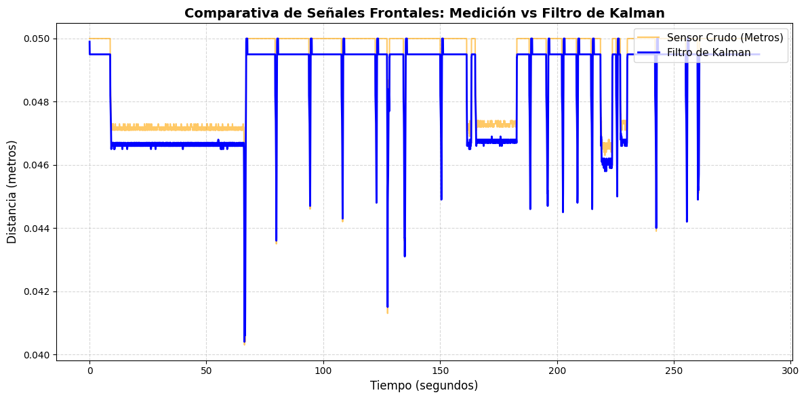
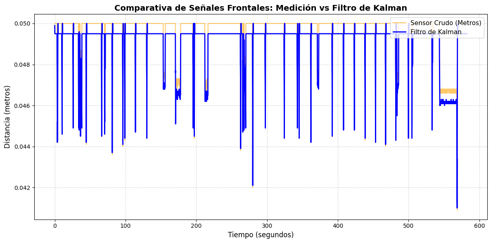
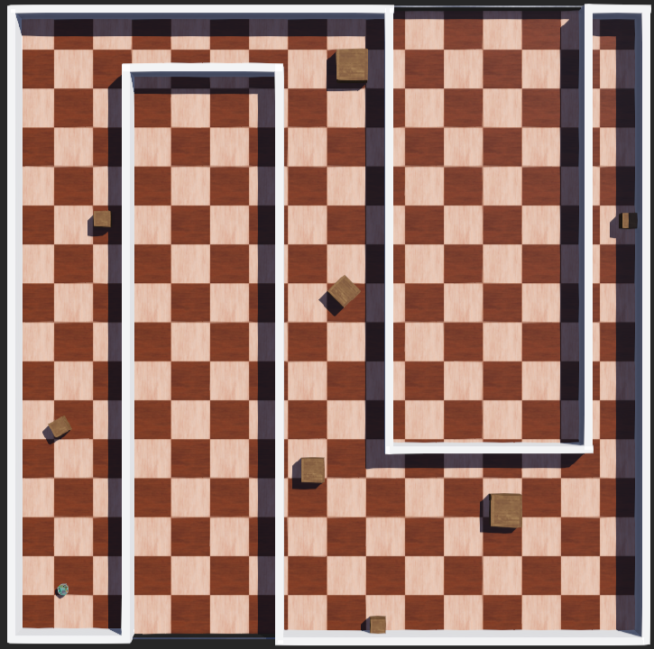
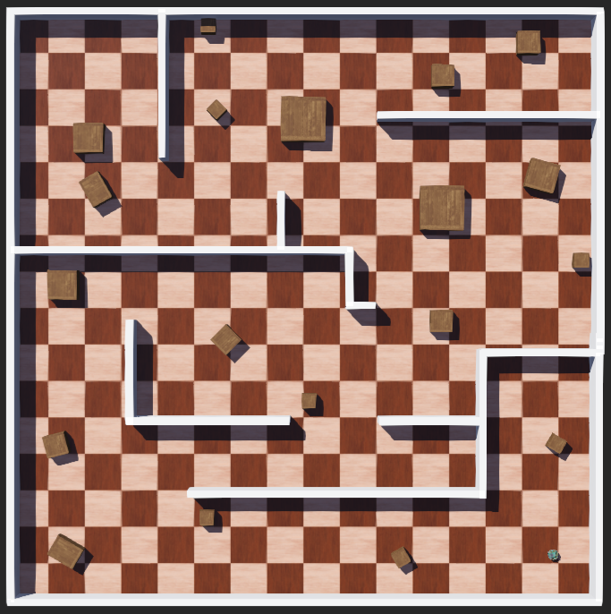

# Laboratorio 2: Navegación Reactiva con Filtrado y Fusión de Sensores en Webots
## Asignatura: Robótica y Sistemas Autónomos (ICI 4150)

### Integrantes:
* Alfredo Escobar
* José Mena
* Branco González
* Michelle Hernández

---

## 1. Objetivo del Trabajo
El objetivo de este laboratorio es implementar un sistema de navegación reactiva para un robot móvil diferencial (e-puck) en el entorno de simulación Webots. Se busca integrar sensores de distancia y encoders de rueda mediante técnicas de filtrado móvil y fusión sensorial con un Filtro de Kalman Escalar. Con esto, se estima la distancia frontal hacia los obstáculos más cercanos de forma robusta frente al ruido para optimizar la toma de decisiones del robot.

---

## 2. Descripción del Robot y Sensores Utilizados
* **Robot Empleado:** Robot móvil diferencial e-puck de código abierto.
* **Sensores de Distancia Frontales:** Sensores infrarrojos `ps0` y `ps7` encargados de capturar la proximidad frontal de los obstáculos. Su rango de lectura cruda oscila entre 0 (despejado, ~0.10 m) y 4095 (colisión inminente, ~0.005 m).
* **Sensores de Distancia Laterales:** Sensores `ps2` (derecho) y `ps5` (izquierdo). Se utilizan con un doble propósito: control proporcional de centrado en pasillos durante la marcha recta y toma de decisiones de evasión ante bloqueos frontales.
* **Encoders de Rueda:** Sensores de posición angular `left wheel sensor` y `right wheel sensor`, con los que se mide el desplazamiento acumulado de cada rueda en radianes para calcular de manera precisa el avance lineal del robot a través de odometría.

---

## 3. Frecuencia de Muestreo y Registro de Datos
* **Tiempo de muestreo ($T_s$):** 32 ms (definido dinámicamente mediante el `basicTimeStep` del mundo en Webots).
* **Frecuencia de muestreo ($f_s$):** 31.25 Hz ($f_s = 1 / T_s$).
* **Cantidad de muestras registradas:** Aproximadamente 6,250 filas de datos recolectadas en un experimento continuo de 200 segundos de simulación activa, almacenadas en el archivo 'datos_sensores.csv'.

---

## 4. Estimación del Avance mediante Encoders
El desplazamiento lineal de cada rueda se calcula en cada paso de simulación a partir de la variación de la posición angular medida por los encoders ($\Delta\theta$), utilizando la relación cinemática de la rodadura:

$$s = r \cdot \Delta\theta$$

Donde $r = 0.0205\text{ m}$ representa el radio de las ruedas del e-puck. 

El avance total del robot ($\Delta d_k$) en un intervalo de tiempo se estima promediando el avance lineal de ambas ruedas:

$$\Delta d_k = \frac{s_{\text{izq}} + s_{\text{der}}}{2}$$

Este desplazamiento incremental es el núcleo de la etapa de predicción geométrica del Filtro de Kalman, asumiendo una trayectoria rectilínea hacia el obstáculo cuando el robot navega de frente.

---

## 5. Filtrado Simple Aplicado
Antes de ingresar al Filtro de Kalman, la lectura de hardware pasa por un procesamiento previo:
* **Fusión por Máximo:** Se toma el valor máximo entre `ps0` y `ps7` $(Valor = \max(ps0, ps7))$. Esto asegura una postura conservadora de seguridad: si un obstáculo ingresa en diagonal por un flanco, el robot reacciona inmediatamente aunque el otro sensor apunte al vacío.
* **Filtro de Promedio Móvil:** Se aplica una ventana deslizante de 3 muestras sobre el valor máximo obtenido para mitigar los picos de ruido blanco de alta frecuencia intrínsecos de los infrarrojos simulados en Webots.
* **Conversión a metros:** La señal filtrada en formato crudo se linealiza y se convierte a unidades métricas mediante una función calibrada para el e-puck, mapeando el rango dinámico del robot desde $0.005\text{ m}$ (contacto) hasta un horizonte máximo de despeje de $0.10\text{ m}$ ($10\text{ cm}$).

---

## 6. Implementación del Filtro de Kalman
Se diseñó e implementó un Filtro de Kalman Escalar dinámico para fusionar la información predictiva de la odometría (encoders) con las observaciones físicas del entorno (sensores infrarrojos de distancia). El filtro opera secuencialmente en tiempo real bajo dos etapas principales en cada paso de simulación:

### A. Etapa de Predicción (Actualización del Estado por Modelo)
En esta fase, el filtro proyecta cuál debería ser la nueva distancia hacia el obstáculo basándose exclusivamente en el movimiento del robot. **Es crítico destacar que la predicción se congela si el robot está girando sobre su propio eje**, ya que la rotación pura no altera la distancia lineal hacia la pared frontal. Si el robot se desplaza en línea recta, se resta el avance medido por los encoders.

A partir del estado previo $\hat{d}_ {k-1}$ y su covarianza del error $P_{k-1}$, se computa el estado predicho $\hat{d}_ {k}^{-}$ y la covarianza predicha $P_{k}^{-}$, incorporando la incertidumbre del modelo cinemático ($Q$):

$$\hat{d}_{k}^{-} = \hat{d}_{k-1} - \Delta d_{k}$$

$$P_{k}^{-} = P_{k-1} + Q$$

### B. Etapa de Corrección (Actualización del Estado por Medición)
Una vez que se obtiene la medición real del sensor ($z_k$) convertida a metros, el filtro calcula la Ganancia de Kalman ($K_k$). Esta matriz escalar actúa como un ponderador dinámico que decide a qué señal hacerle más caso (si al modelo geométrico o a la lectura del sensor). Finalmente, se corrige la estimación de la distancia ($\hat{d}_{k}$) y se actualiza la covarianza del error ($P_k$) para el siguiente ciclo:

$$K_k = \frac{P_{k}^{-}}{P_{k}^{-} + R}$$

$$\hat{d}_{k} = \hat{d}_{k}^{-} + K_k \cdot (z_k - \hat{d}_{k}^{-})$$

$$P_k = (1 - K_k) \cdot P_{k}^{-}$$

### Parámetros de Ajuste Utilizados:
* **Incertidumbre del Proceso ($Q$):** `0.01` (Representa la confianza en la precisión geométrica de los encoders).
* **Varianza del Ruido del Sensor ($R$):** `0.02` (Representa la magnitud de las fluctuaciones físicas y el ruido de alta frecuencia del sensor analógico).

---
## 7. Lógica de Navegación Reactiva
El control combina una estrategia proporcional para el mantenimiento de pasillos y una secuencia basada en tiempo/ciclos para las maniobras de evasión de 90°:

1. **Navegación Recta con Control Lateral Proporcional:** Mientras el frente está despejado, el robot avanza a una velocidad crucero ($0.5 \cdot MAX\_SPEED$). Si los sensores laterales (`ps2` o `ps5`) superan el ruido base de $80.0$, se calcula un error de centrado ($Error = ps2 - ps5$). Un controlador **KP = 0.003** ajusta de forma diferencial los motores, permitiendo al robot alejarse de las paredes laterales y navegar en perfecta estabilidad por el centro de pasillos estrechos sin rozar.
2. **Activación de Evasión:** Si la distancia métrica final estimada por Kalman cae por debajo de los $0.05\text{ m}$ ($5\text{ cm}$), el robot interrumpe la marcha y entra en modo evasión.
3. **Fase de Despegue:** El e-puck retrocede de forma rectilínea durante exactamente 10 ciclos para despegarse del obstáculo y adquirir espacio de maniobra.
4. **Decisión de Dirección y Giro de 90°:** Al finalizar el retroceso, se comparan los sensores laterales. Si $ps5 > ps2$, el obstáculo lateral está a la izquierda, por lo que se ejecuta un giro horario sobre su propio eje (hacia la derecha). En caso contrario, gira a la izquierda. La rotación se mantiene fija durante 45 ciclos de reloj para garantizar un ángulo limpio de 90° antes de restablecer el modo de avance recto.

---

## 8. Análisis de Señales y Gráficos

A continuación, se presentan las gráficas comparativas de las señales durante las pruebas:

### A. Comparativa de Señales Frontales en Tiempo Real de Entorno Simple

#### Análisis Detallado del Gráfico (Muestreo de 200 Segundos):
Al evaluar la gráfica obtenida a partir del archivo de logs, se evidencian de forma clara las ventajas de la fusión sensorial frente al procesamiento convencional:

* **Supresión Eficiente del Ruido Blanco:** En los tramos horizontales superiores (por ejemplo, entre los segundos 10 y 65 o entre 165 y 180), la línea naranja (`Sensor_Metros`) muestra un comportamiento varianza de alta frecuencia debido a las interferencias inherentes del sensor. En contraste, la línea azul (`Kalman_Distancia`) cruza de manera sólida y completamente suavizada por el centro de la nube de datos, demostrando que el filtro discrimina de forma óptima el ruido eléctrico y ambiental, previniendo micro-oscilaciones en los motores.
* **Respuesta Dinámica Ante Obstáculos:** Periódicamente (en los segundos 65, 80, 95, 110, 128, etc.), la distancia cae abruptamente en caída libre. Estos eventos representan el momento exacto en que el robot encuentra una pared al frente. La línea azul acompaña la caída de la línea naranja sin retrasos significativos (*time-lags*), lo que comprueba que la Ganancia de Kalman ($K_k$) se eleva correctamente priorizando la medición real cuando el entorno cambia de forma imprevista, asegurando una evasión oportuna.
* **Estabilización en Espacio Despejado:** Cuando el robot completa su giro de 90° y el frente queda libre, ambas señales regresan al límite superior calibrado de $0.05\text{ m}$, manteniendo al robot en velocidad de crucero constante hasta el próximo muro.

### B. Comparativa de Señales Frontales en Tiempo Real de Entorno Complejo

#### Análisis Detallado del Gráfico Complejo (Muestreo de 600 Segundos):
La extensión del tiempo de muestreo a 10 minutos permitió registrar un volumen de 18,750 muestras, revelando patrones cinemáticos de alta exigencia:
* **Periodicidad y Densidad de Eventos de Evasión:** A diferencia de la gráfica del entorno simple, donde las caídas son distanciadas, la señal en el entorno complejo se compone de ráfagas cíclicas y continuas de aproximación extrema. Esto refleja de forma fidedigna que el robot está inmerso en una topología cerrada que lo obliga a conmutar sus estados lógicos de maniobra con una frecuencia hasta tres veces mayor.
* **Robustez Frente a la Fatiga del Filtro:** A pesar de la acumulación de errores de odometría debido a las constantes rotaciones sobre el eje, la línea azul (`Kalman_Distancia`) no sufre desviaciones temporales ni descalibraciones en su horizonte estacionario. La estimación permanece estable en el centro de la varianza del sensor, validando la estrategia de congelar la etapa de predicción durante las velocidades angulares puras.
* **Recuperaciones Limpias:** Cada pico hacia los $0.040\text{ m}$ es corregido inmediatamente hacia los $0.050\text{ m}$ por la secuencia cíclica temporizada de despegue (retroceso), demostrando gráficamente la resiliencia del controlador para restablecer la navegación sin perderse en estados indefinidos.

---

## 9. Resultados en los Escenarios de Prueba
Para evaluar el desempeño de la navegación reactiva fusionada, se diseñaron y ejecutaron simulaciones en dos entornos con niveles de dificultad incremental dentro de Webots:

### A. Entorno 1: Ambiente Simple (Pocos obstáculos)

* **Descripción:** Este escenario consiste en un circuito cerrado y delimitado con obstáculos aislados, diseñado específicamente para que el robot **siga una trayectoria o recorrido secuencial predefinido**. El e-puck dispone de pasillos limpios para transitar de forma predecible antes de encontrarse con una colisión frontal.
* **Comportamiento del Robot y Estabilidad:** Bajo esta configuración de trayectoria guiada, el e-puck mostró un desplazamiento rectilíneo altamente estable. Al aproximarse a un obstáculo de forma perpendicular, la distancia estimada por el Filtro de Kalman disminuyó de manera suave y continua. Al cruzar el umbral de seguridad, el robot realizó rotaciones limpias hacia el flanco con mayor espacio libre y reanudó la marcha sin registrar oscilaciones, logrando completar el circuito trazado de forma fluida.

### B. Entorno 2: Ambiente Complejo (Más obstáculos)

* **Descripción:** Este escenario simula una pista cerrada tipo laberinto caracterizada por paredes continuas, esquinas consecutivas, pasillos estrechos y una alta densidad de obstáculos cúbicos interconectados. A diferencia del primer entorno, aquí **el robot no tiene una trayectoria establecida y se mueve de manera autónoma explorando todo el espacio disponible**. Debido a que el movimiento es disperso y el mapa posee un número significativamente mayor de objetos, **el experimento se dejó correr durante 10 minutos continuos (600 segundos)** para permitir al e-puck cubrir y resolver la mayor cantidad de zonas posibles.
* **Comportamiento del Robot y Capacidad de Evasión:** A lo largo de la exploración libre, el robot exhibió un alto desempeño adaptativo. El control proporcional lateral estabilizó la marcha centrándolo de forma automática en los pasillos angostos mediante la lectura de `ps2` y `ps5`. Al toparse con los obstáculos frontales distribuidos aleatoriamente, el Filtro de Kalman registró las aproximaciones con precisión, gatillando las secuencias coordinadas de retroceso y rotación sobre su propio eje sin registrar colisiones destructivas ni atascos estructurales.

#### Caso de Borde Identificado (Limitación del Algoritmo Reactivo):
Durante pruebas de estrés prolongadas en el entorno complejo, se identificó un escenario muy particular en el cual el robot puede llegar a quedar atrapado de forma intermitente. Esto ocurre cuando el e-puck impacta de manera perfectamente frontal y perpendicular contra la arista o esquina de un objeto cúbico centrado respecto a su eje de simetría.

* **Análisis de la Falla:** Al aproximarse en un ángulo de 90° perfectos, los sensores frontales (`ps0` y `ps7`) registran exactamente la misma distancia, activando correctamente la maniobra de retroceso. Sin embargo, al momento de decidir el sentido de giro, los sensores laterales izquierdo (`ps5`) y derecho (`ps2`) devuelven lecturas idénticas o simétricas debido a la equidistancia de las paredes del entorno. 
* **Efecto en el Comportamiento:** Aunque el código cuenta con una regla por defecto para forzar un giro en caso de igualdad empírica, las micro-variaciones por fricción en las ruedas simuladas o el ruido de alta frecuencia en el microsegundo exacto de la toma de datos pueden causar que el robot alterne erráticamente entre girar a la izquierda y a la derecha en ciclos consecutivos. Esto genera un bucle de oscilación (*chattering*) donde el robot retrocede, intenta girar a un lado, vuelve a detectar simetría y cancela la evasión, quedando atrapado temporalmente en el mismo lugar.
* **Propuesta de Mejora Futura:** Para resolver esta limitación geométrica sin alterar la naturaleza reactiva del controlador, se propone integrar un mecanismo de ruptura de simetría probabilístico en la toma de decisiones (usando funciones pseudoaleatorias como `random.choice([-1, 1])`), forzando al robot a romper el bucle matemático y escapar inmediatamente de colisiones perpendiculares perfectas.

---

## 10. Análisis Final y Conclusiones
* **Conclusión sobre los tipos de señal:** El uso de lecturas crudas en robótica reactiva es inviable a nivel práctico dado que el ruido provoca activaciones falsas de evasión o frenadas bruscas. Si bien un promedio móvil suaviza la señal, introduce un retardo temporal perjudicial a altas velocidades. La fusión sensorial mediante el Filtro de Kalman resolvió el dilema al balancear la predictibilidad matemática de la odometría con la realidad física del sensor infrarrojo, entregando una señal limpia y de respuesta instantánea.
* **Lecciones Aprendidas:** Se constató que el Filtro de Kalman debe ajustarse en estrecha relación con el estado del vehículo. Restar el avance de las ruedas durante un giro estático induce errores graves de estimación en el filtro. Al aislar cinemáticamente las etapas de predicción según el estado de movimiento (recto o giro), el filtro adquiere robustez conceptual y matemática, permitiendo un comportamiento autónomo fiable en entornos de complejidad incremental.

---

## 11. Instrucciones para Ejecutar la Simulación (Descarga Directa)

Siga estos pasos para descargar el proyecto de forma manual sin utilizar la terminal:

### A. Requisitos Previos
* **Webots:** Instalado en su última versión estable.
* **Python 3.X:** Configurado en las variables de entorno del sistema (`PATH`).

### B. Descarga del Proyecto
* **Descargar ZIP:** Entre al enlace del repositorio en GitHub (`https://github.com/TheFanking/Laboratorio-2`).
* **Extraer Archivos:** Haga clic en el botón verde **Code** (esquina superior derecha), seleccione **Download ZIP** y descomprima el archivo en cualquier carpeta de su computador.

### C. Ejecución en Webots
* **Cargar el Mundo:** Inicie Webots, diríjase a `File` > `Open World...` y abra el archivo `.wbt` del escenario deseado (Simple o Complejo) dentro de la carpeta descomprimida.
* **Asignar Controlador:** En el panel izquierdo de Webots, expanda las propiedades del robot **e-puck** y verifique que el campo `controller` apunte al script de Python del proyecto.
* **Solución de errores:** Si Webots no detecta el entorno, vaya a `Tools` > `Preferences` > `Python Command` y pegue la ruta del ejecutable de su Python local.
* **Simular:** Presione el botón **Play** o **Fast** en la barra superior para iniciar la navegación autónoma con el Filtro de Kalman. Las salidas de telemetría se desplegarán en la consola inferior en tiempo real.
